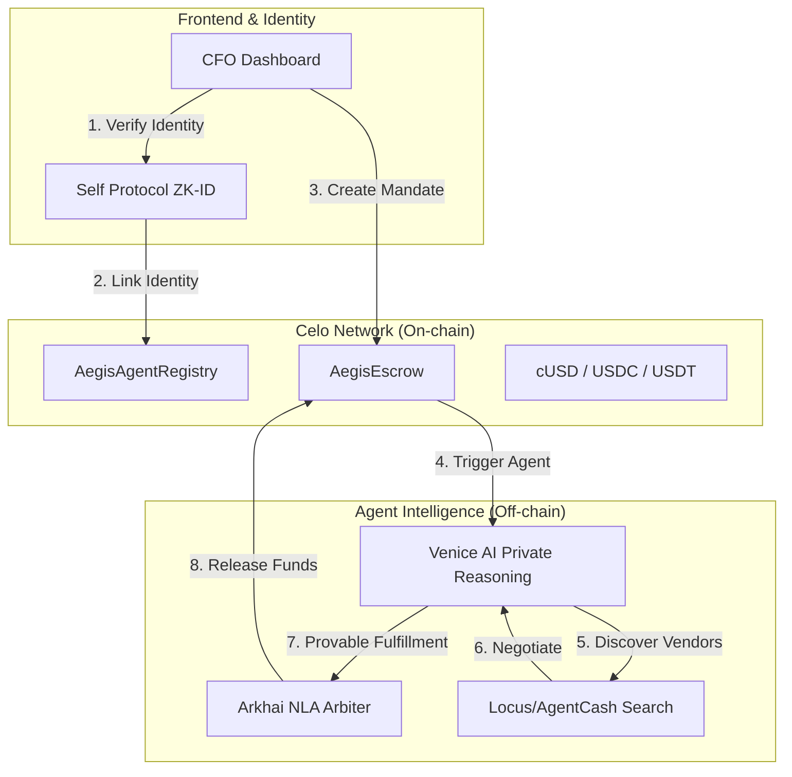
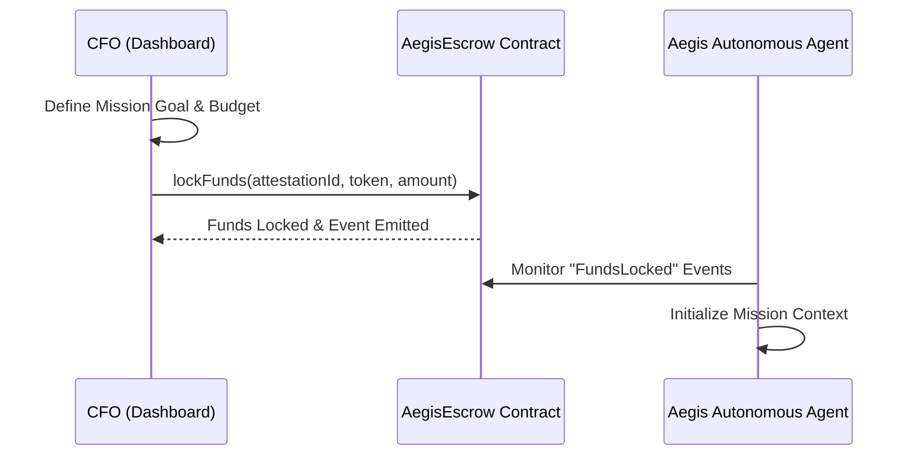
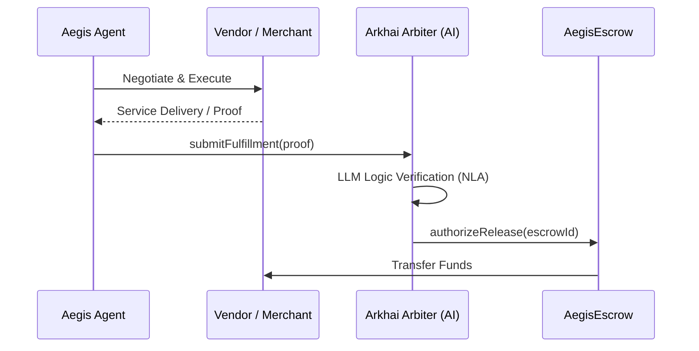

# Aegis Confidential Concierge (ACC)

A privacy-first, autonomous procurement agent for businesses. Built on **Celo** and powered by a high-depth **Technological Foundation**, Aegis ensures maximum product impact and engineering defensibility for automated agentic commerce.

## Vision

Aegis enables businesses to delegate complex procurement and search tasks to a trusted autonomous agent. By combining ZK-identity, verifiable commitments, and private reasoning, Aegis creates a secure bridge between natural language negotiations and on-chain settlement.

## Technological Foundation

Aegis leverages the full potential of the Celo ecosystem:

### **Integration Stack**

1.  **MetaMask (Master Control):** **[FULL]** Used for ERC-7715 budget delegation and **EIP-7702** Smart Account detection/upgrades.
2.  **Locus (Agent Utility):** **[FULL]** Decentralized Agent Utility on **Base** for discovery and audit trail anchoring via `postIntent`.
3.  **Venice AI (Private Brain):** **[FULL]** Handles all "Private Negotiation" logic via privacy-preserving specialized LLMs.
4.  **Arkhai (Arbiter):** **[FULL]** Logic implemented in the agent engine to fulfill mandate NLAs and anchor proofs of completion.
5.  **EAS (Attestation):** **[FULL]** Anchors deal intent and fulfillment hashes securely on Celo Sepolia.
6.  **Self Protocol (Identity):** **[FULL]** Powers the `AegisAgentRegistry` for verified agent metadata using ZK-Identity disclosures.
7.  **Celo (Settlement Layer):** **[FULL]** Low-fee, mobile-native home for all core business logic, escrows, and financial settlement.

### **The Hybrid Bridge (Synthesis)**

Aegis acts as a cross-chain coordinator:

- **Assets & Settlement:** Remain secure on **Celo**.
- **Operational Utility & Discovery:** Powered by **Locus on Base**.
- **Trust & Auditability:** Shared across chains via EAS and Locus Intent Logging.

---

## System Architecture

Aegis operates at the intersection of AI reasoning and blockchain settlement. The architecture ensures that while the agent is autonomous, it remains under the strict control/budget of the CFO.



---

## Core Flows

### 1. Mandate Creation & Budget Delegation

The CFO defines a "Mission Intent" (e.g., "Find a Lisbon office for May, budget $5k"). Funds are locked in the `AegisEscrow` contract, specifically tied to this intent.



### 2. Autonomous Procurement & Settlement

Once funded, the agent uses Venice AI to privately reason about the procurement strategy. It discovers vendors, negotiates terms, and finally submits a proof of fulfillment to the Arkhai Arbiter for automated fund release.



---

## Live Implementation (Celo Sepolia)

The core infrastructure is live on Celo:

| Contract / Asset        | Address                                      |
| :---------------------- | :------------------------------------------- |
| **AegisAgentRegistry**  | `0x9447878DE8F455505A17B13e9895913795f494Ed` |
| **AegisEscrow**         | `0xB013B3127cdd71C1A3413FC4867F906b92dc38e4` |
| **Arkhai Arbiter**      | `0x5Bcc3564F079c1094371dE737682B935755b8062` |
| **USDC (Celo Sepolia)** | `0xe230A1eFcd14f13e5e47F45606011C65164229B3` |
| **USDT (Celo Sepolia)** | `0xd718019889CD2B39AD9FF2241BB17A709E980F9F` |

---

## Getting Started

### 1. Prerequisites

- **Node.js** (v18+)
- **pnpm** (v8+)
- **MetaMask** with Celo Sepolia configured

### 2. Setup

```bash
# Install dependencies
pnpm install

# Build the system
pnpm build

# Start the dashboard
cd apps/web
pnpm dev
```

### 3. Smart Contract Management

```bash
# Navigate to contracts
cd apps/contracts

# Run tests
pnpm test

# Deploy to Celo Sepolia
pnpm deploy:celo
```

---

## Project Structure

### **Monorepo Layout**

- **`apps/agent`** — Node.js Autonomous Engine
    - `src/index.ts`: Core mission orchestration & Venice AI private reasoning.
    - `src/locus-service.ts`: Agent-side Locus integration for intent auditing.
    - `src/request-credits.ts`: Utility for managing non-custodial agent utility credits.

- **`apps/contracts`** — Celo Smart Contracts (Solidity)
    - `contracts/AegisEscrow.sol`: Sovereign settlement & automated escrow release.
    - `contracts/AegisAgentRegistry.sol`: Verified Agent Metadata & ZK-Identity (ERC-8004).
    - `scripts/`: Implementation scripts for atomic deployment & contract verification.
    - `test/`: Comprehensive unit tests for on-chain state transitions.

- **`apps/web`** — CFO Management Dashboard (Next.js)
    - `src/app/`: App Router views & specialized API handlers (e.g., Self ZK-Callback).
    - `src/components/dashboard/`: High-fidelity terminal-vibes UI (Wealth Matrix, Activity Panel).
    - `src/hooks/`: Data orchestration layer (`useMandates`, `useEscrowMetrics`, `useIntelligenceLogs`).
    - `src/lib/`: Unified Service Architecture (MetaMask 7702/7715, Arkhai NLA, Self Protocol).

---

## Advanced MetaMask Integration

### **1. EIP-7702 Smart Account Support**

Aegis detects if your MetaMask EOA has been upgraded to a **Smart Account**.

- **Verification**: The system uses `getPublicClient().getCode(address)` to inspect for the `0xef0100` delegator prefix.
- **Ready for 7702**: The dashboard dynamically adapts UI elements (like the 'Authority Confirmed' badge) based on implementation-level detection.

### **2. Aegis Intent Protocol (Delegation)**

For fine-grained budget control, Aegis implements **Intent-based Delegation**:

- **EIP-191 Intent**: The CFO signs a human-readable statement authorizing a specific mission budget.
- **Verification**: This intent is anchored to the **Locus Audit Trail** on Base, creating a cryptographically verifiable bridge between the CFO's permission and the Agent's autonomous execution.
- **Future-Proof**: Integrated with `@metamask/smart-accounts-kit` for a seamless transition to full **ERC-7715** native permissions.

---

## Business ROI & Real-World Use Cases

Aegis is designed for **High-Friction Enterprise Commerce**:

1.  **Freelance & Project Management**: Automate milestone-based payments (Brand Design, Development) where funds are only released upon "Arkhai-verified" fulfillment of the NLA (Natural Language Agreement).
2.  **Autonomous Treasury Rebalancing**: CFOs can delegate complex "Search & Buy" mandates (e.g., "Hedge 10% of portfolio into USDC if CELO slips below $0.50").
3.  **Procurement & Logistics**: The agent discovery phase (via Locus/Exa) allows businesses to find the best deals across the Celo ecosystem autonomously.

---

## License

This project is licensed under the **MIT License**.
