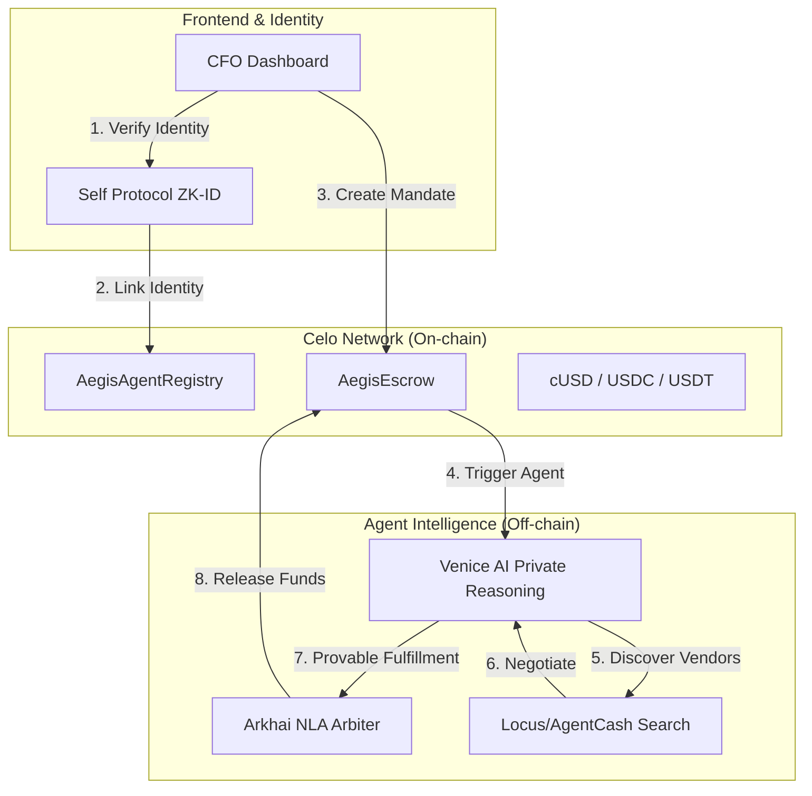
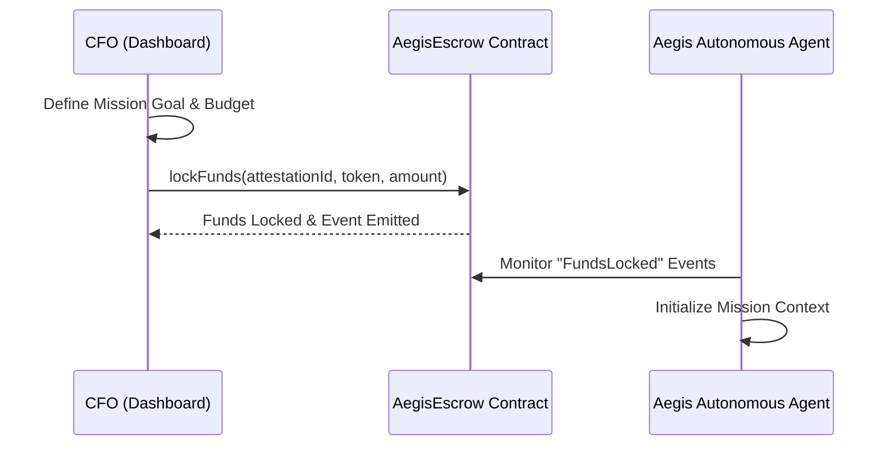
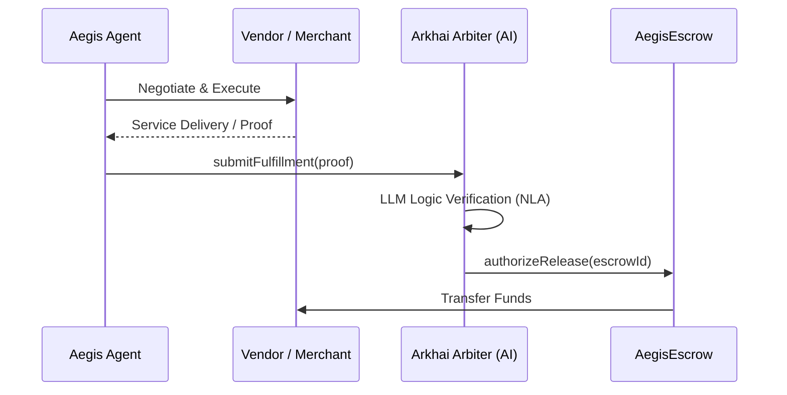

# Aegis Confidential Concierge (ACC)

A privacy-first, autonomous procurement agent for businesses. Built on **Celo** and powered by the **Power 7** integration stack, Aegis ensures maximum product impact and engineering defensibility for automated agentic commerce.

## Vision

Aegis enables businesses to delegate complex procurement and search tasks to a trusted autonomous agent. By combining ZK-identity, verifiable commitments, and private reasoning, Aegis creates a secure bridge between natural language negotiations and on-chain settlement.

## The Power 7 Stack

Aegis leverages the full potential of the Celo ecosystem:

- **Venice AI**: Private reasoning and confidential negotiation strategy.
- **Celo Mainnet**: High-speed, low-cost settlement layer.
- **Self Protocol**: ZK-Humanity and OFAC compliance gating via ZK-ID.
- **EAS (Ethereum Attestation Service)**: Transparent, on-chain deal anchoring.
- **MetaMask**: Secure CFO master control and transaction signing.
- **Protocol Labs (ERC-8004)**: Standardized Trustless Agent Identity.
- **Locus & AgentCash**: Autonomous vendor discovery and search tools.

---

## System Architecture

Aegis operates at the intersection of AI reasoning and blockchain settlement. The architecture ensures that while the agent is autonomous, it remains under the strict control/budget of the CFO.



---

## Core Flows

### 1. Mandate Creation & Budget Delegation
The CFO defines a "Mission Intent" (e.g., "Find a Lisbon office for May, budget $5k"). Funds are locked in the `AegisEscrow` contract, specifically tied to this intent.



### 2. Autonomous Procurement & Settlement
Once funded, the agent uses Venice AI to privately reason about the procurement strategy. It discovers vendors, negotiates terms, and finally submits a proof of fulfillment to the Arkhai Arbiter for automated fund release.



---

## Live Implementation (Celo Sepolia)

The core infrastructure is live on Celo:

| Contract | Address |
| :--- | :--- |
| **AegisAgentRegistry** | `0xf6A298be1F9997B05A089526116D8F4BDD38b31c` |
| **AegisEscrow** | `0x1993202E3917454baA65538EE877a1661A051287` |
| **Arkhai Arbiter** | `0x6CcCfe0CD13E14B5f43C88065B3138bAC2058298` |

---

## Getting Started

### 1. Prerequisites
- **Node.js** (v18+)
- **pnpm** (v8+)
- **MetaMask** with Celo Sepolia configured

### 2. Setup
```bash
# Install dependencies
pnpm install

# Build the system
pnpm build

# Start the dashboard
cd apps/web
pnpm dev
```

### 3. Smart Contract Management
```bash
# Navigate to contracts
cd apps/contracts

# Run tests
pnpm test

# Deploy to Celo Sepolia
pnpm deploy:celo
```

---

## Project Structure

- `apps/agent` - Node.js Agent Core (Venice AI & Reasoning)
- `apps/contracts` - Aegis Smart Contracts (Solidity & Hardhat)
- `apps/web` - CFO Management Dashboard (Next.js + Tailwind)

---

